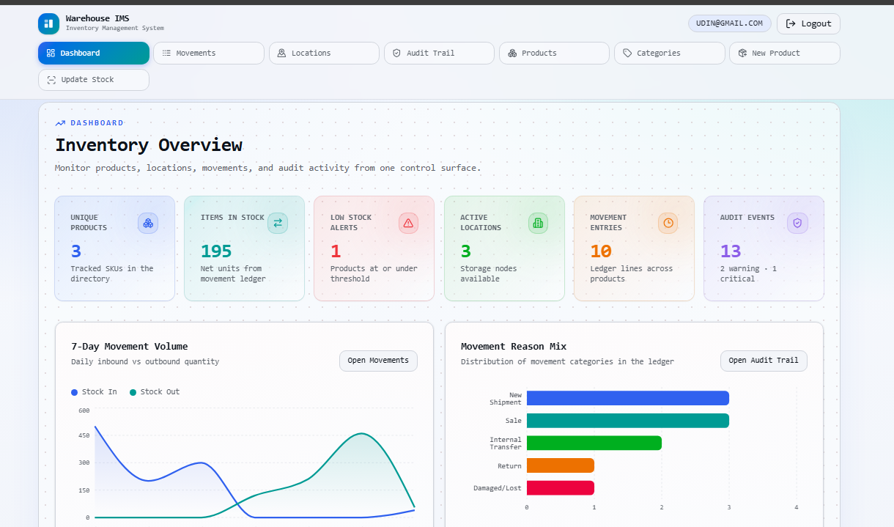

# Warehouse Inventory Manager

A sleek, modern inventory management system built with Next.js 15, React 19, Tailwind CSS v4, and SQLite. This system features real-time stock tracking, categorization, transaction ledgers, location management, and role-based auditing—all wrapped in a premium, glassmorphism-inspired UI.




## Features

- **Dashboard**: High-level overview of total stock, recent movements, volume trends (powered by Recharts), and reason breakdown.
- **Product Management**: Create and track products with SKUs, descriptions, and low-stock thresholds.
- **Product Categories**: Organize products with color-coded categories for easy filtering and visual identification.
- **Location Management**: Define physical or logical zones (e.g., Warehouse, Retail, Transit) with set capacities.
- **Transaction Ledger**: Strict "In" and "Out" transaction tracking for full accountability.
- **Audit Logging**: Automatic tracking of system events, threshold changes, and stock movements.

---

## Tech Stack

- **Framework**: [Next.js](https://nextjs.org/) (App Router, Turbopack)
- **Styling**: [Tailwind CSS v4](https://tailwindcss.com/) & [Radix UI primitives](https://www.radix-ui.com/)
- **Charts**: [Recharts](https://recharts.org/)
- **Database**: [SQLite](https://sqlite.org/) via [@libsql/client](https://github.com/tursodatabase/libsql-client-ts)
- **ORM**: [Drizzle ORM](https://orm.drizzle.team/)
- **Authentication**: [Better Auth](https://better-auth.com/)

---

## Getting Started

### Prerequisites

You need [Node.js](https://nodejs.org/) (v18 or newer) and `npm` installed.

### 1. Clone & Install

```bash
git clone https://github.com/yourusername/inventory-management-system.git
cd inventory-management-system
npm install
```

### 2. Configure Environment Variables

Create a `.env` file in the root of the project by copying the example file (if present) or creating a new one:

```bash
# .env

# Database configuration (using local SQLite file)
DATABASE_URL=file:./local.db

# Authentication secret (Generate a strong 32+ char string for production)
# You can generate one via: npx @better-auth/cli secret
BETTER_AUTH_SECRET=your_super_secret_string_here

# Base URL of the application
BETTER_AUTH_URL=http://localhost:3000
```

### 3. Initialize the Database

Push the schema to your local SQLite database:

```bash
npm run db:push
```

### 4. Seed Data (Optional but Recommended)

Populate the database with mock locations, categories, products, and a transaction history so you can see the dashboard in action:

```bash
npm run db:seed
```

### 5. Run the Local Development Server

Start the Turbopack dev server:

```bash
npm run dev
```

The app will be available at [http://localhost:3000](http://localhost:3000).

---

## Project Structure Highlights

- `app/(app)`: Authenticated routes encompassing the dashboard, products, categories, locations, and movements.
- `app/api`: Server-side API routes for Next.js endpoints.
- `components/`: Reusable UI elements (cards, forms, tables, nav) and Radix primitives.
- `lib/db/`: Drizzle schema definition (`schema.ts`) and db connection utility.
- `lib/inventory-service.ts`: Core business logic for reading/writing inventory data.
- `scripts/`: Development scripts, including the database seeder `seed.ts`.

---

## License

This project is licensed under the MIT License - see the [LICENSE](LICENSE) file for details.
